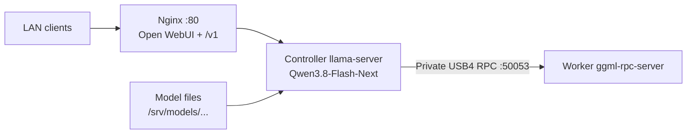
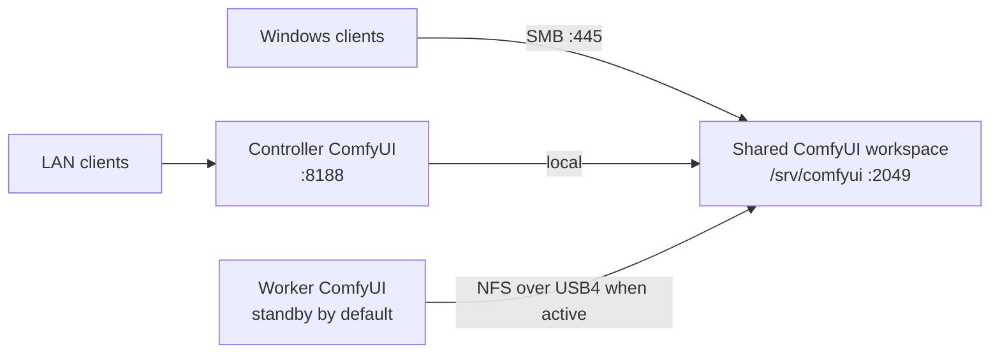

# Strix Halo Cluster

Yet another setup process for a two-PC AMD Strix Halo cluster.

This instance uses two 128 GB AMD Strix Halo PCs (Bosgame M5 nodes) linked over USB4 as a private AI cluster. The default workload profile hosts Qwen3.8-Flash-Next for two concurrent inference users while reserving controller headroom for one ComfyUI user. A system monitoring dashboard can also be installed.

## Features

- Turnkey scripts. Start with a fresh Ubuntu install and the scripts handle all the rest.
- The tested Bosgame M5 nodes are linked over USB4. The verifier targets at least 8 Gbit/s over the private link. A USB4 data cable is required. I use https://link.amazon/B03prmZHS
- Qwen3.8-Flash-Next supports the Q4, Q5, and Q6 quantization presets and different context window sizes. The default Q4 profile uses two slots and a `24,76` controller-to-worker tensor split to reserve more controller memory for ComfyUI.
- ComfyUI is installed on both nodes with a shared workspace for models, custom-node source, workflows, inputs, and outputs. The controller service is active by default; the peer service is installed in standby to protect the Qwen RPC worker.
- Native Hunyuan3D workflows use an automatically selected, ComfyUI-only SDPA compatibility policy for the Radeon 8060S. The installer prefers default attention when it passes an exact-shape GPU probe and otherwise enables the verified Math SDPA fallback.
- The controller exposes the shared ComfyUI workspace as an anonymous, read/write `comfyui` share so Windows clients can manage models, custom-node source, workflows, inputs, and outputs without SSH.
- Both nodes provide remote desktop services and each exposes an anonymous, read/write `xfer` folder on the network for maintenance from Windows clients.
- Qwen3.8-Flash-Next sessions served by the cluster have been tested from Windows clients using Open WebUI in a web browser, [AnythingLLM](https://anythingllm.com/) on the desktop, VS Code [extensions](https://marketplace.visualstudio.com/items?itemName=AndrewButson.github-copilot-llm-gateway), and custom tools using the Copilot SDK.

### Caveats

[Bosgame M5](https://strixhalo.wiki/Hardware/PCs/Bosgame_M5/) was selected as it was the least expensive 128GB Strix Halo option available in Aug 2026. However, it is limited by 2.5Gbps Ethernet and generic 20Gbps USB4 (not true Intel Thunderbolt). [OdinLink](https://github.com/Geramy/OdinLink-Five) is not compatible. TCP-over-USB4 has been the only workable option tested so far. These scripts are specific to that hardware and other [Sixunited AXB35](https://strixhalo.wiki/Hardware/Boards/Sixunited_AXB35/) motherboard systems.

The goal of this configuration is `multiple concurrent users` with access to QWEN3.8-Flash-Next and ComfyUI instances. It is not designed for maximum throughput for a single user. 

This is all configured for a trusted, private LAN environment. No security measures are taken beyond basic firewall settings and disabling Wi-Fi/Bluetooth radios. The `xfer` and `comfyui` shares are anonymous and read/write. This is not a configuration to expose to the internet or public networks.

The XFCE desktop installed for Ubuntu is bare-bones and ugly, but uses very little GPU and memory. I chose this to keep as many resources free for the AI models as possible.


### Benchmark

This is an earlier three-slot throughput reference, not the current two-Qwen-
user plus one-ComfyUI-user default:

- QWEN3.8-Flash-Next Q4_K_XL 512Ki context window, 3 parallel user slots:
    - 382.1 tok/s prompt rate, 15.9 tok/s generation

- TCP-over-USB4 throughput:
    - ~9Gbps.

Dashboard includes USB4 and Benchmark tests.

### Sample Dashboard

...

## Architecture

### LLM inference



The controller serves the LAN API and coordinates inference; the worker provides remote GPU layers over `usb4llm0` (`10.200.0.0/30`).

### ComfyUI and shared storage



Both nodes have ComfyUI installed, but only the controller starts it by default.
The controller owns the shared workspace, exports it to the worker over the
private link, and exposes its managed folders to Windows over SMB. The peer
instance can be activated when Qwen is idle. XRDP and the per-node `xfer`
shares are omitted from this focused diagram.

### Hunyuan3D compatibility

ComfyUI `v0.39.0` directly invokes PyTorch scaled dot-product attention in two
native Hunyuan3D VAE paths. On the tested Radeon 8060S (`gfx1151`) stack with
PyTorch `2.11.0+rocm10.0.0`, the default, Flash, and Efficient SDPA backends
fail with `hipErrorInvalidValue`. Math SDPA passes the same float16
`[1,16,4096,64]` self-attention layout, the decoder's
`[1,16,8000,64]`-by-`[1,16,4096,64]` cross-attention layout, and the full
`VAEDecodeHunyuan3D` path.

`setup-comfyui.sh` pins the tested ComfyUI revision, applies a small managed
patch to both direct Hunyuan3D attention calls, and runs each GPU backend test
in a fresh process. Its default `--hy3d-sdpa auto` mode uses default SDPA when
it passes and otherwise sets `COMFY_HY3D_FORCE_MATH_SDPA=1` only in
`comfyui.service`. Rerunning the installer after a future PyTorch upgrade
automatically retires the fallback once default SDPA passes. Use
`--hy3d-sdpa default` to require the default backend or `--hy3d-sdpa math` to
require the fallback.

The Math backend is slower; the diagnostic 4096-latent VAE decode took about
246 seconds. The patch does not alter system ROCm, `llama.cpp`, or either Qwen
unit. The installer records the active Qwen unit's PID before provisioning and
fails if that service stops or restarts. It also refuses to replace unrelated
tracked edits in the local ComfyUI checkout.

## Requirements

- Ubuntu 26.04.1 or later is the tested baseline on both nodes. The installers require `apt-get` and `systemd`.
- Two nodes connected by USB4 and reachable by their LAN hostnames
- An unprivileged Linux account on each node; use matching UID/GID values for the shared ComfyUI store
- Sufficient local storage for the selected model and, if enabled, the optional peer RPC cache
- A trusted LAN: the default Samba shares are anonymous and read/write

The installer planning estimates are 110 GiB for Q4, 150 GiB for Q5, and 160 GiB for Q6. For a fresh download, allow roughly 129 GiB, 173 GiB, and 183 GiB of free space respectively because the installer reserves 25 GiB during download. The optional peer RPC disk cache is disabled by default. Q5 and Q6 are experimental on this two-node topology. If Hugging Face authentication is required, set `HF_TOKEN` and preserve it through `sudo`, for example: `sudo --preserve-env=HF_TOKEN bash setup-qwen3d8.sh ...`.

## Quick start

Copy all scripts to the Ubuntu machines and run. Replace the placeholders and use the same Linux account and quantization on both nodes. Remember, reboots may be required before services are active. If you monitor with the included dashboard you'll see it may take a few minutes for the cluster to report itself as 'Healthy'. Some of the services need time to connect and establish their links. 

For these scripts, one machine is the 'server' and the other is the 'peer'. The server is the box your users will connect to.
Copy the same scripts to both machines, but be sure to run them with the correct parameters on each machine.
Some scripts have more options if you want to customize the setup further.

```bash
# 1. Base environment: run on both nodes. Must be done first.
# Run on the server first, then the peer using the proper --role settings for each
sudo bash setup-environment.sh --role server --user <linux-user>  # server
sudo bash setup-environment.sh --role peer --user <linux-user>    # peer

# 2. After reboot you can verify both nodes (be sure USB4 cable is connected)
sudo bash verify-environment.sh  # server
sudo bash verify-environment.sh  # peer

# 3. Distributed Qwen3.8: two slots with controller headroom for ComfyUI
sudo bash setup-qwen3d8.sh --role server --user <linux-user> --quant Q4 --parallel 2 --balance 24,76 --context 256 --skip-foundation # server
sudo bash setup-qwen3d8.sh --role peer --user <linux-user> --quant Q4 --parallel 2 --balance 24,76 --context 256 --skip-foundation   # peer

# 4. Optional ComfyUI: active on the controller, installed in standby on the peer
sudo bash setup-comfyui.sh --server <controller-host> --peer <worker-host> --role server --service-mode active --user <linux-user>   # server
sudo bash setup-comfyui.sh --server <controller-host> --peer <worker-host> --role peer --service-mode standby --user <linux-user>   # peer

# 5. Optional dashboard: run on the server first, then the peer using the proper --role settings for each
sudo bash dashboard/setup-dashboard.sh --role server --dashboard-host 0.0.0.0   # server
sudo bash dashboard/setup-dashboard.sh --role peer  # peer
```

The controller downloads the model and serves the API; the worker provides the USB4 RPC service. If you skip the preliminary environment step, omit `--skip-foundation` from `setup-qwen3d8.sh` and let that script run it.

For two Q4 slots with an extended 512 Ki-token-per-slot context, replace
`--context 256` with `--context 512` in both Qwen setup commands. Keep
`--balance 24,76` to reserve controller headroom for ComfyUI. The installer
automatically configures 2x YaRN scaling and the required temporary GGUF
metadata override; run the two-user capacity test and a representative
controller ComfyUI workflow together before using the extended window in
production.

## Scripts

| Script | Purpose |
| --- | --- |
| `setup-environment.sh` | Base node setup: USB4, Samba file drop, XRDP, SSH, and UFW |
| `setup-comfyui.sh` | Pinned controller-active and peer-standby ComfyUI, automatic Hunyuan3D SDPA compatibility selection, an NFS-shared workspace, and a controller-side Windows share |
| `setup-qwen3d8.sh` | ROCm, `llama.cpp`, Qwen3.8 model, RPC services, and controller web UI |
| `verify-environment.sh` | Checks services, networking, firewall rules, and USB4 throughput |
| `dashboard/` | Independent telemetry agent, Python test runner, Gradio dashboard, and dashboard-only installer |

## Services and defaults

- USB4: `usb4llm0`, controller `10.200.0.1`, worker `10.200.0.2`
- RPC worker: private TCP port `50053`
- Qwen3.8: Q4, two parallel inference slots, `24,76` controller-to-worker balance, and 192 Ki tokens per slot by default; use `--context 256` for the native 256 Ki tokens per slot, or `--context 512` for Q4 with automatic 2x YaRN scaling
- Open WebUI and OpenAI-compatible API: `http://<controller>/` and `http://<controller>:80/v1/`
- Cluster dashboard: `http://<controller>:7860` after installing `dashboard/setup-dashboard.sh`
- ComfyUI: controller at `http://<controller>:8188`; peer installed in standby
- Windows ComfyUI workspace: `\\<controller>\comfyui`
- Windows file drop: `\\<node>\xfer`; XRDP: `<node>:3389`
- XRDP redirected Windows drives: `~/thinclient_drives` inside the remote session
- SSH: `<node>:22` (OpenSSH server, installed and enabled by `setup-environment.sh`)


All scripts are designed to be rerun safely. Use `--help` for the complete option list, review any `Action required` messages, and use `sudo qwen3d8-status` or `sudo usb4-cluster-status` for diagnostics. Rerunning `setup-qwen3d8.sh` on the server restarts the controller service so it always picks up a freshly rebuilt `llama-server` (for example after a vendored patch or commit update); this briefly interrupts any active inference.

The dashboard is maintained separately from the provisioning scripts. See
[`dashboard/README.md`](dashboard/README.md) for its installation, telemetry
agent, configurable capacity tests, persistent token-rate statistics,
command-line tests, restricted Qwen and ComfyUI restart controls, and Gradio
interface.

The Qwen installer installs both the GPU-targeted ROCm runtime and the matching
ROCm core development package. The latter supplies HIP's CMake package, which
is required to build llama.cpp; installing only the runtime package is
insufficient.

## Windows access to the ComfyUI workspace

The server role of `setup-comfyui.sh` exposes the shared store at
`\\<controller>\comfyui`. Open that path in Windows Explorer to copy files
directly into these folders:

| Folder | Purpose |
| --- | --- |
| `models` | Checkpoints, LoRAs, VAEs, ControlNet models, and other model types |
| `custom_nodes` | Custom-node source shared by both ComfyUI checkouts |
| `workflows` | Workflows available to both ComfyUI instances |
| `input` | Source images and other workflow inputs |
| `output` | Generated images and other workflow outputs |

Only the controller exports this SMB share. The peer sees the same changes
through the private NFS mount. Both ComfyUI checkouts link their
`custom_nodes` directories to the shared folder. Virtual environments,
installed Python packages, user data, Manager configuration, and temporary
files remain local to each worker. The shared Hugging Face cache and cluster
metadata are hidden from SMB clients.

The share name can be changed with `--smb-share-name <name>`, or omitted with
`--no-smb-share`. Rerun the server-side ComfyUI setup command to add the share
to an existing installation. Because access is anonymous and read/write, any
client on an allowed LAN can replace or delete assets.

> [!WARNING]
> Files below `custom_nodes` are executable Python code. A client that can
> write to this anonymous share can execute code as the ComfyUI service account
> when either instance loads or reloads custom nodes. Allow TCP port `445` only
> from a fully trusted LAN, never forward the share through a router, and do
> not use this configuration on an untrusted network.

The installer assigns all exposed workspace folders to the shared `aimodels`
group, adds group write access recursively, and installs inherited default
ACLs so nested model and custom-node directories created later remain writable
over SMB. It runs nested read/write/delete tests through SMB in every exposed
folder and directly through the shared filesystem on both nodes. Setup stops
if any mapped folder fails these checks. Rerun the updated server-side
installer if an older installation exposes writable top-level folders but
read-only subdirectories.

### Remote custom-node setup

Custom-node source can be copied or extracted into
`\\<controller>\comfyui\custom_nodes\<node-name>` from Windows. To finish a
node installation without SSH:

1. Open ComfyUI Manager on the controller and install or repair the custom
   node's dependencies in the controller's local virtual environment.
2. Restart controller ComfyUI from the cluster dashboard or Manager.
3. Import the workflow and confirm that the controller reports no missing
   nodes or import failures.

The source tree is shared, but Python dependencies and loaded process state
are not. If the standby peer instance will be used, start it only when Qwen is
idle, install the dependency in its local virtual environment, and verify it
separately. Pass `--service-mode active` when rerunning the peer installer only
if peer ComfyUI should become boot-persistent.

When converting existing installations, rerun `setup-comfyui.sh` on the
controller first and the peer second. The controller's copy is canonical. The
peer copies only custom-node entries that are missing from the shared tree and
preserves its original directory as
`custom_nodes.local-before-sharing-<timestamp>` for manual comparison. It does
not overwrite an existing shared Git repository.

## Windows file transfer through XRDP

XRDP supports Windows drive redirection and clipboard transfer through its
`xrdp-chansrv` channel server. Xorg provides the remote display and Xfce
provides the desktop. FUSE is used for redirected-drive mounts, not clipboard
transfer. The installer enables the `rdpdr` and `cliprdr` channels, installs
FUSE, and mounts selected Windows drives under `~/thinclient_drives`.

With the built-in Windows client (`mstsc.exe`):

1. Select **Show Options** before connecting.
2. On **Local Resources**, leave **Clipboard** selected.
3. Select **More...**, expand **Drives**, and select the Windows drives to share.
4. Connect using the configured Linux account.
5. In the Xfce file manager, open **Home** and then `thinclient_drives`. The
   selected drives appear there, usually as `C on <Windows-PC>` and similar.

Drive redirection must be selected before the RDP session starts. Direct
drag-and-drop from a local Windows Explorer window onto an Xfce window is not
provided by XRDP; use the redirected drive or copy/paste between file-manager
windows. If the drives are not visible, disconnect and reconnect after
selecting them, then check `sudo bash verify-environment.sh --skip-throughput`
and the per-session `xrdp-chansrv` log under `~/.local/share/xrdp/`.

The SMB maintenance share remains available as a simpler fallback:
`\\<node>\xfer`. It does not depend on an active XRDP session and is useful
when Windows policy disables RDP drive redirection.

## Concurrent physical and XRDP logins

On Ubuntu systems using `dbus-user-session`, same-user physical-console and
XRDP sessions can conflict because they may share D-Bus session state. A user
logged in at the physical console can therefore see a black screen or a failed
XRDP login when the same account is used remotely.

The default installer session is XFCE. It starts the XRDP XFCE session with
its own D-Bus bus by clearing `DBUS_SESSION_BUS_ADDRESS` before launching
`dbus-launch`, while preserving `XDG_RUNTIME_DIR` for `systemd --user`,
terminals, and desktop applications. This allows a best-effort separate local
and remote session without sharing the physical desktop. Rerun
`setup-environment.sh` on each node and reconnect after applying the change.

These are separate desktops: XRDP does not attach to or mirror the physical
console session. Some applications and `systemctl --user` services still
assume one graphical session. GNOME is not a reliable choice for this
arrangement; use the managed XFCE session or a separate Linux account for
reliable maintenance access. Pass `--no-concurrent-local` to retain the
standard single-session behavior.

---

> If you enjoy this project, please consider:

<a href="https://www.buymeacoffee.com/mighty_studios" target="_blank">
  
</a>

<small>(The joy I get from a free latte is incredible)</small> 