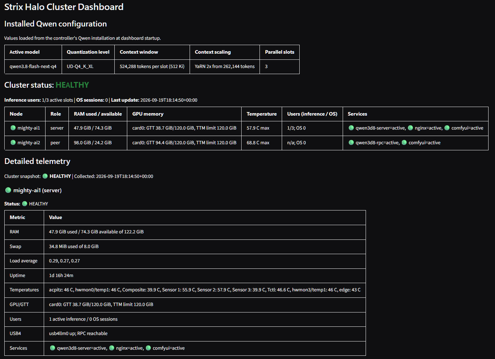

# Strix Halo Cluster Dashboard

This directory is intentionally independent from the cluster provisioning
scripts. It contains the private node telemetry and controlled-action agent,
the on-demand verification tests, the Gradio dashboard, and the installer for
those components.

## Install

Run the installer on the controller and worker after the normal cluster setup:

```bash
# For three extended 512 Ki Q4 slots, configure Qwen3.8 first:
# setup-qwen3d8.sh enables 2x YaRN automatically above the native 256 Ki limit.
sudo bash setup-qwen3d8.sh --role server --user <linux-user> --quant Q4 --context 512 --skip-foundation
sudo bash setup-qwen3d8.sh --role peer --user <linux-user> --quant Q4 --context 512 --skip-foundation

# Controller
sudo bash dashboard/setup-dashboard.sh \
  --role server \
  --dashboard-host 0.0.0.0

# Worker
sudo bash dashboard/setup-dashboard.sh --role peer
```

The installer reads `/etc/qwen3d8/cluster.env` and
`/etc/default/usb4-cluster`, installs the dashboard into
`/opt/qwen3d8-dashboard`, and creates:

- `qwen3d8-node-agent.service` on both nodes
- `qwen3d8-dashboard.service` on the controller
- `qwen3d8-server-restart.service` on the controller
- `qwen3d8-comfyui-restart.service` on both nodes

Rerunning the installer copies the current dashboard files and restarts its
managed services, so it is also the supported way to deploy dashboard updates.
When deploying this update to an existing cluster, rerun the worker installer
first and the controller installer second so the private restart endpoint is
available when the new dashboard becomes active.

The controller dashboard includes a **Restart Qwen server** button. It starts a
dedicated root-owned systemd helper through a polkit rule restricted to the
dashboard service account; it cannot directly control arbitrary services.
Restarting interrupts active inference requests, and the dashboard remains
degraded until the model finishes loading.

The dashboard also includes **Restart controller ComfyUI**, **Restart peer
ComfyUI**, and **Restart both ComfyUI workers** controls. Each node has a
root-owned ComfyUI helper and a polkit rule that permits the dashboard service
account to start only that helper. The combined action attempts both nodes
even if one restart fails and reports each result. Restarting ComfyUI
interrupts active workflows on the selected node, so use these controls only
after current jobs finish.

The worker agent listens only on the private cluster address. The dashboard
defaults to port `7860`; the agent defaults to port `8765`. UFW rules are
added for the private agent link and the configured LAN networks. Its
`POST /actions/restart-comfyui` endpoint is enabled only for the worker role,
accepts requests only from the configured controller private IP, honors the
optional agent token, and can start only the dedicated ComfyUI helper. It
cannot control arbitrary systemd units.

The capacity-test defaults are configurable at install time:

```bash
sudo bash dashboard/setup-dashboard.sh \
  --role server \
  --test-input 65536 \
  --test-output 8192 \
  --test-parallel 1 \
  --test-repetitions 3 \
  --test-safety-margin 96
```

The dashboard installer accepts a smaller timing-test workload independently
from the installed Qwen capacity. The default is 65,536 prompt input tokens,
8,192 output tokens, one parallel slot, one warmup request, and three measured
repetitions. The generated context budget includes the output token count and
the safety margin. It also reads `CONTEXT_PER_SLOT` and `PARALLEL_SLOTS` from
`/etc/qwen3d8/cluster.env`, which is written by `setup-qwen3d8.sh`; those
installed values remain the source of truth for configuration checks.
For Q4, `--context 512` configures a 512 Ki per-slot context with 2x YaRN
scaling from the model's native 256 Ki window.

Because the dashboard can start a large capacity test and restart cluster
services, use basic authentication when it is reachable by more than a fully
trusted LAN:

```bash
sudo bash dashboard/setup-dashboard.sh \
  --role server \
  --auth-user admin \
  --auth-password-file /root/dashboard-password
```

## Command-line tests

The test runner can be used without Gradio:

```bash
python3 dashboard/cluster_tests.py --config /etc/qwen3d8/dashboard.json configuration
python3 dashboard/cluster_tests.py --config /etc/qwen3d8/dashboard.json runtime
python3 dashboard/cluster_tests.py --config /etc/qwen3d8/dashboard.json capacity
python3 dashboard/cluster_tests.py --config /etc/qwen3d8/dashboard.json usb4
python3 dashboard/cluster_tests.py --config /etc/qwen3d8/dashboard.json all
```

The capacity test sends the configured number of concurrent synthetic requests
to `llama-server`. The prompt input and output token counts are separate
settings. Override them for a one-off CLI run:

```bash
python3 dashboard/cluster_tests.py \
  --config /etc/qwen3d8/dashboard.json \
  capacity --input-tokens 65536 --output-tokens 8192 --parallel 1 \
  --repetitions 3
```

The dashboard's **Capacity Test** section provides one configurable timing
action. It can run an optional warmup followed by repeated measured requests
and reports the median prompt, generation, and wall-clock rates. Set measured
repetitions to `1` to disable aggregation, or use `--no-warmup` for a cold
measurement. The action asks for confirmation because it interrupts normal
inference and sends synthetic requests. The dashboard shows the parameters
and median from the latest recorded series below the aggregate results.
The output-token setting is a maximum because the test honors the model's
natural end-of-sequence token.
The capacity-test timeout is derived automatically from the requested token
workload and parallel-slot count, with extra headroom for long-context tests.
An optional `capacity_timeout` value in the dashboard JSON can override that
calculation, but normal installations do not need one.
`llama-server` occasionally corrupts a single generation under sustained
load and reports it as an HTTP 500 "does not match the expected ... format"
error from its chat-message parser. This is an unresolved upstream
generation bug reproduced across ROCm, CUDA, and Vulkan backends (see
[ggml-org/llama.cpp#26381](https://github.com/ggml-org/llama.cpp/issues/26381)
and [ggml-org/llama.cpp#20260](https://github.com/ggml-org/llama.cpp/issues/20260)),
not a cluster misconfiguration. `setup-qwen3d8.sh` applies a small vendored
patch (see [`patches/README.md`](../patches/README.md)) to the pinned
llama.cpp build so a failed final parse salvages whatever content was
recognized instead of throwing, which removes this error for any request
where at least some output was parseable. The capacity test still retries an
affected slot up to twice and notes the retry in its output, as a safety net
for the rare case where nothing at all was parseable, and for deployments
running an unpatched llama.cpp build.

Each completed capacity request records prompt tokens/s, generation tokens/s,
wall-clock throughput, token counts, context size, and concurrency in the
SQLite database configured by `metrics_db` (normally
`/var/lib/qwen-dashboard/token-rates.sqlite3`). The dashboard shows
last-hour, last-24-hour, last-7-day, and all-time aggregates, plus per-slot
rates from the latest triggered test. Run capacity tests when no production
inference is active.

## Dashboard contents

The **Service controls** section provides separate Qwen, controller ComfyUI,
peer ComfyUI, and combined ComfyUI restart buttons. Every restart requires a
browser confirmation and is refused while a dashboard diagnostic is running.

The status area refreshes every five seconds and reports:

- installed Qwen model, quantization, per-slot context window, and slot count
- controller and worker health
- active inference slots and configured slot capacity
- used and available system RAM, swap, load, uptime, and disk space
- kernel temperature sensors and fan RPM readings when exposed by `hwmon`
- AMD DRM VRAM/GTT readings and the configured TTM limit when exposed by sysfs
- Qwen, RPC, Nginx, and ComfyUI service state
- USB4 link state and the established controller-to-worker RPC connection

The dashboard counts active llama.cpp slots as active inference users. The
current API does not authenticate human identities, so an idle Open WebUI
browser session cannot be distinguished from an idle client connection.

The controller checks its existing RPC connection rather than opening a second
connection to `ggml-rpc-server`, which serves one controller connection at a
time. The worker reports whether its private RPC listener is bound locally.

The USB4 throughput test is executed by the worker agent against the
controller's existing private `iperf3` service, then reports both worker-to-
controller and controller-to-worker directions.

The dashboard also includes a **Cancel running test** control and an in-memory
**Clear error log** control. The error log is in-memory. Cancellation is cooperative for inference tests and
terminates an active USB4 `iperf3` subprocess. The error log records telemetry
errors, failed assertions, warnings, and cancellation requests.


